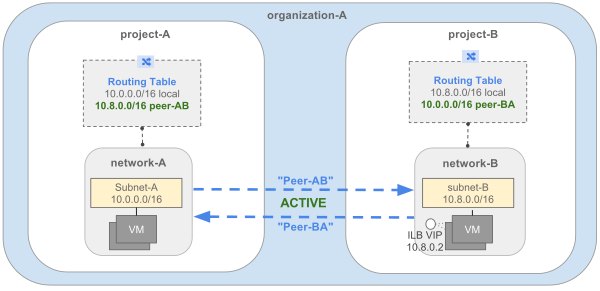
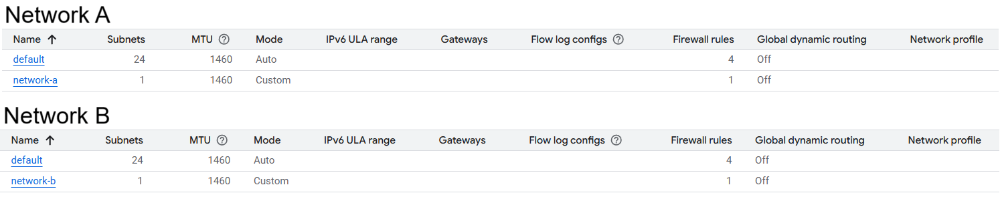
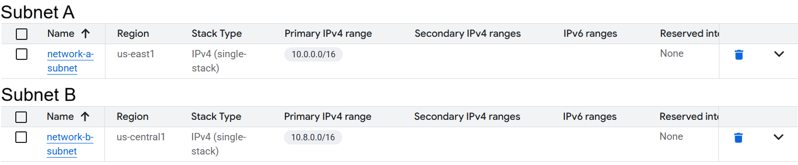
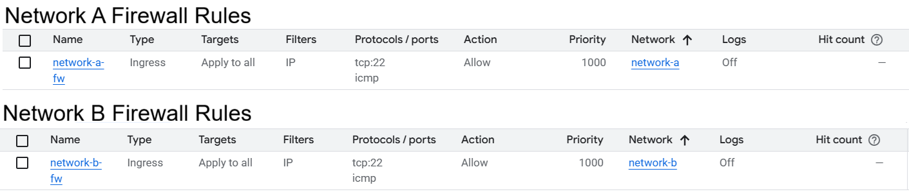
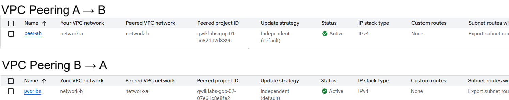
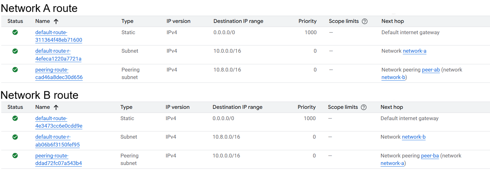
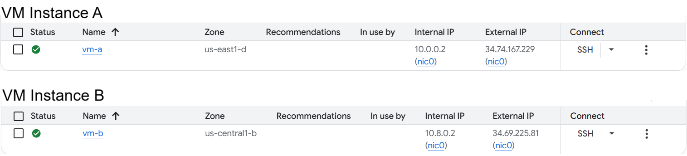
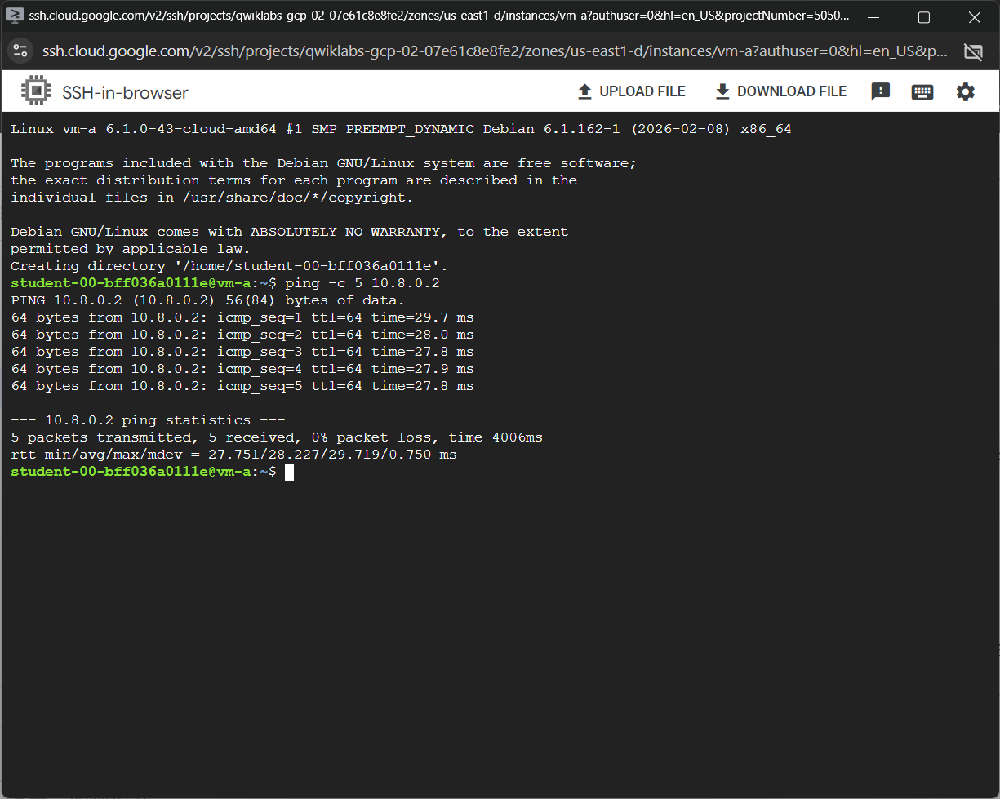
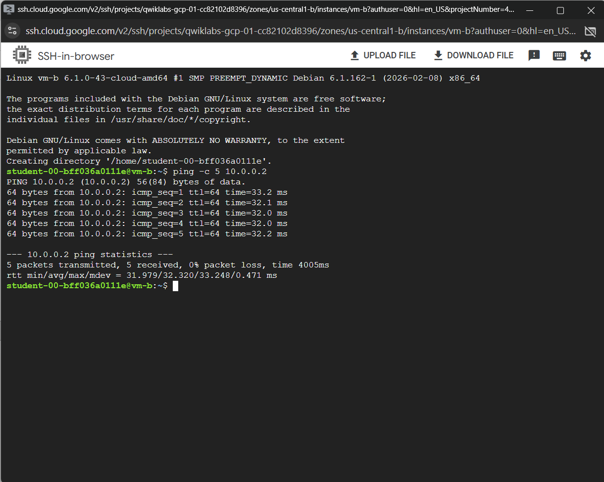

# 🌐 VPC Peering in Google Cloud (GCP)

## 📌 Overview

This project demonstrates **VPC Network Peering between two separate Google Cloud projects**, enabling private communication between resources without using public IPs.

---

## 🏗️ Architecture



---

## 🧠 Key Concepts Covered

* VPC Network Peering (cross-project)
* Custom VPC networks
* Subnet configuration
* Firewall rules (ICMP + SSH)
* Route propagation via peering
* Private VM-to-VM communication

---

## ⚙️ Environment Details

| Component    | Network A                    | Network B                    |
| ------------ | ---------------------------- | ---------------------------- |
| Project ID   | qwiklabs-gcp-02-07e61c8e8fe2 | qwiklabs-gcp-01-cc82102d8396 |
| VPC Network  | network-a                    | network-b                    |
| Subnet Range | 10.0.0.0/16                  | 10.8.0.0/16                  |
| VM Instance  | vm-a (10.0.0.2)              | vm-b (10.8.0.2)              |

---

## 🔧 Implementation Steps

### 1. Create VPC Networks

Two custom VPC networks were created in separate projects.
  * `network-a`
  * `network-b`




---

### 2. Configure Subnets

Each VPC was assigned a non-overlapping CIDR range.
* network-a → `10.0.0.0/16`
* network-b → `10.8.0.0/16`



---

### 3. Create Firewall Rules

* Allowed traffic:
  * SSH (`tcp:22`)
  * ICMP (ping)



---

### 4. Configure VPC Peering

* Peering was configured in both directions:

- Network A → Network B
- Network B → Network A

Status: **Active**



---

### 5. Verify Routes

* Peering routes automatically created
* Verified:

  * 10.0.0.0/16
  * 10.8.0.0/16



---

### 6. Deploy VM Instances

* vm-a → network-a
* vm-b → network-b



---

## ✅ Connectivity Testing

### 🔁 Ping from Network A → Network B

```bash
ping 10.8.0.2
```



---

### 🔁 Ping from Network B → Network A

```bash
ping 10.0.0.2
```



---

## 🎯 Result

✔ **Private VM-to-VM communication established across projects**  
✔ **No public internet exposure (secure internal traffic only)**  
✔ **Dynamic routing achieved using VPC peering**  
✔ **Firewall rules enforced for controlled access**

---

## 📁 Project Structure

```
.
├── architecture/
├── screenshots/
├── setup/
├── validation/
└── README.md
```

---

## 🚀 Key Takeaways

* VPC Peering enables **low-latency private communication**
* Works across **different projects**
* Requires:

  * Non-overlapping CIDR ranges
  * Firewall configuration
  * Route propagation
* No transitive peering (important limitation)

---

## 📌 Author

Satyam
